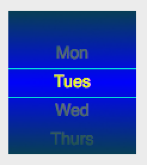

# QPickerWidget

QPickerWidget is a [QT](https://qt-project.org/)-compatible widget which offers an elegant replacement for a standard drop-down control (i.e. [QComboBox](http://qt-project.org/doc/qt-4.7/qcombobox.html)) on QT embedded Linux platforms with a touchscreen.

## Features

- customizable background (using a style class selector or [QPixmap](http://qt-project.org/doc/qt-4.7/qpixmap.html))
- customizable label, target-line, and target-line label style class selectors
- uses [QMouseEvent](http://qt-project.org/doc/qt-4.7/qmouseevent.html) to scroll the picker (for embedded platforms that do not support [QGestureEvent](http://qt-project.org/doc/qt-4.7/qgestureevent.html))

## Requirements

- Requires QT 4.7 or later (currently tested against QT 4.7.3)

## Usage

To use, simply construct a QPickerWidget with the following attributes:

- frame ([QRect](http://qt-project.org/doc/qt-4.7/qrect.html))
- id (used to identify this picker in the _moved_ slot)
- height of each row
- [QList](http://qt-project.org/doc/qt-4.7/qlist.html) of row titles
- style class selectors that map to the [QApplication](http://qt-project.org/doc/qt-4.7/qapplication.html)'s stylesheet

If desired, also connect the _moved_ signal to a slot in your class to be notified when the user scrolls the picker. Alternatively use the `index()` or `currentValue()` methods to get the picker's current value.

## Sample code

    QApplication app(argv, args);
    app.setStyleSheet(".background_picker { background-color: blue }"
                ".label_picker { font: 14pt; color: gray }"
                ".targetline_picker { background-color: aqua }"
                ".targetlabel_picker { font: 14pt; color: yellow }");
    ...

    QList<QString> list;
    list << "Mon" << "Tues" << "Wed" << "Thurs" << "Fri" << "Sat" << "Sun";
    
    int uniqueId = 123;
    int itemHeight = 24;
    
    QPickerWidget *picker = new QPickerWidget(QRect(...), uniqueId, itemHeight, list,
            "background_picker", QPixmap(), QPixmap("/path/to/picker/overlay"), "label_picker",
            "targetline_picker", "targetlabel_picker", this);

    connect(picker, SIGNAL(moved(int, int)), this, SLOT(pickerMoved(int, int)));
    picker->show();
    picker->setIndex(1);
	
## License

Usage is provided under the <a href="http://www.apache.org/licenses/LICENSE-2.0" target="_blank">Apache License</a> (v2.0).
